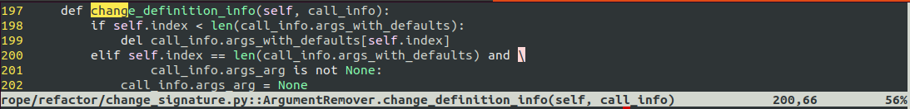

# vim-location-awareness

This plugin provides a function for formatting a short text that describes
where you are in a code, such as function or class name where the cursor is
located. This context line usually would be displayed in the statusline.

Install this repository using your usual Vim package manager then read 
`:help locationawareness` and `:help 'statusline'` for how to add this to your
statusline.
